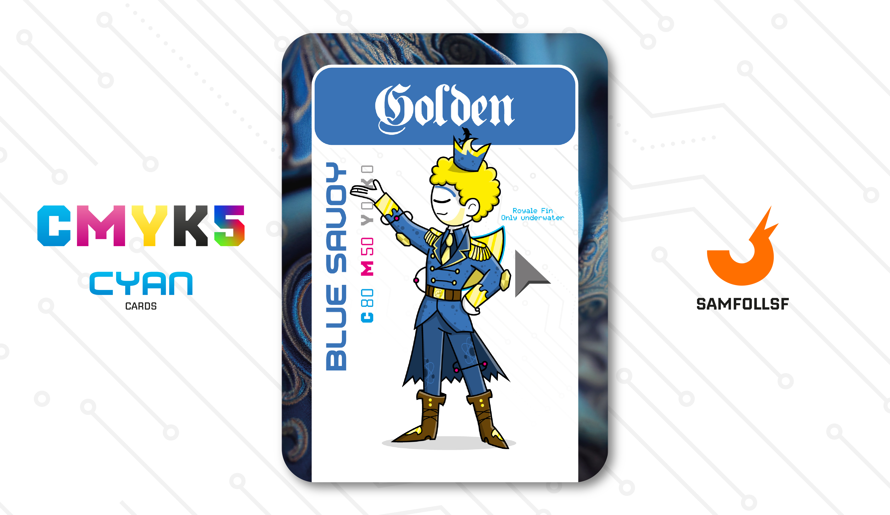

---
tags:
  - Original

...

# Golden

## Descrizione

PlaceHolder

## Colore

Il Blu Savoia è in realtà una sfumatura di azzurro. Deve il suo nome al fatto di esser stato il colore di Casa Savoia, dinastia regnante in Italia dal 1861 fino al 1946.

## Curiosità