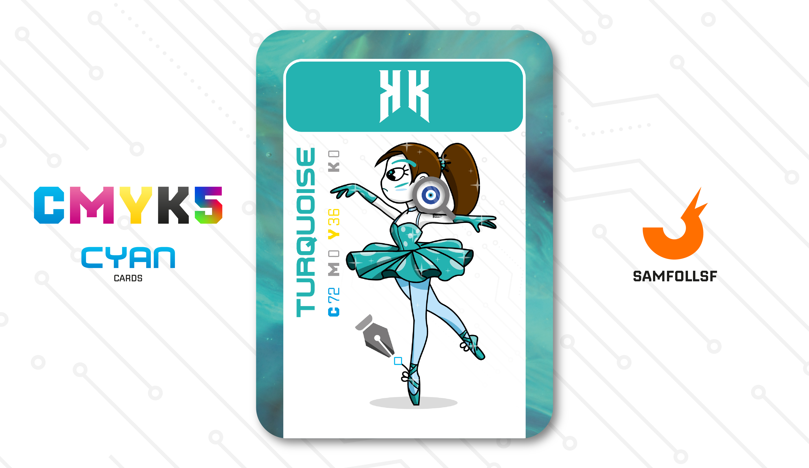

---
tags:
  - Original

...

# KK

## Descrizione

Nel Web, nonostante la criminalità, la corruzione, la morte e le guerre, c'è ancora spazio per l'arte e la cultura, e la danza non fa eccezione. Non sono molte le ballerine che scelgono questa strada, poiché è un servizio accessibile solo all'élite del Web, a chi ha denaro e tempo per godersi uno spettacolo. Tuttavia, può rivelarsi estremamente redditizio per chi riesce ad entrare nei circuiti degli spettacoli più importanti.

## Colore

Blu tendente al verde, il Turchese è fresco e vivace, perfetto per la stagione calda. Il nome deriva da questa gemma molto apprezzata sin dall'antichità: troviamo testimonianze già presso Egizi, Maya e Aztechi. Plinio la definiva callaina.

## Curiosità

- aaa

# Versione Mazzo 1.0