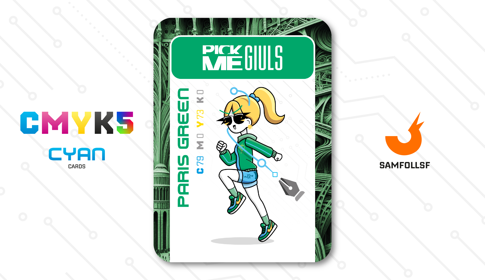

---
tags:
  - Snoctix.inc

...

# PickMeGiuls

## Descrizione

PlaceHolder

## Colore

Il Verde di Parigi è un colore particolare che spopolava in mezza Europa, ma ricordato come "di Parigi" per averne derattizzato le fogne. Veniva infatti prodotto con un agente chimico che conteneva una piccola parte di arsenico. Qualcuno ipotizzò potesse anche essere pericoloso sin dal 1839, ma era così richiesto!

## Curiosità