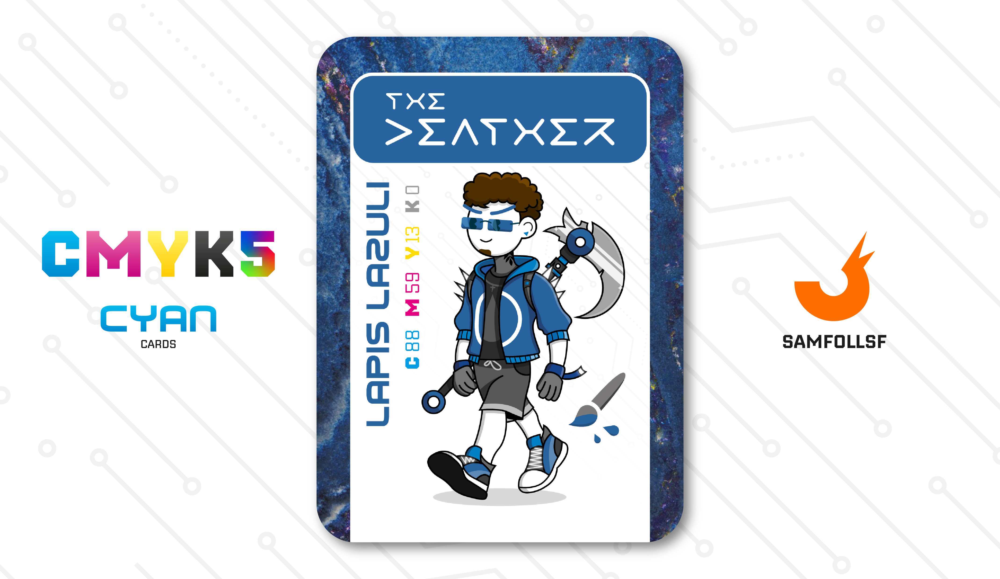

---
tags:
  - The Other Side

...

# The Deather

## Descrizione

È un negromante, un amico di vecchia data di SamFollSF. Nell'universo del Web, il suo compito è rintracciare le tracce dell'anima di un defunto attraverso piccoli rover inviati nel [Dark Web](../Remix/deep.md). Questi dispositivi ricevono un segnale con l’obiettivo di identificare il codice sorgente del deceduto, ovvero ciò che rimane di un abitante del Web dopo la sua morte.

Quando una persona muore, il suo codice sorgente si disperde inizialmente nell’aria, vicino al luogo del decesso. Da lì, inizia un viaggio tra [Surface Web](../Remix/deep.md) e [Deep Web](../Remix/deep.md), fino a depositarsi infine nell’abisso del Dark Web. Qui, il codice può rimanere dai 5 giorni fino a un massimo di 12 mesi, prima di dissolversi completamente.

I rover riescono a captare frammenti di pensieri che il defunto ha avuto poco prima di morire. Sebbene questi ritrovamenti siano estremamente rari, per i suoi clienti rappresentano una fiammella di speranza.

## Colore

Nel I secolo d. C. Plinio il Vecchio descrisse il lapislazzulo come "un frammento della volta stellata del cielo", quasi a ricordare le stelle con le sue venature d'oro. Pietra quasi magica, tenuta in gran conto dagli alchimisti, Michelangelo ne fece uso abbondantemente per affrescare il suo "Giudizio Universale".

## Curiosità

- È un abilissimo pilota sulle due ruote. Preferisce infatti spostarsi per il Surface Web con il suo SimJet blu al quale è molto legato.
- Spende il proprio tempo libero insieme a SamFollSF nelle varie sale scommesse presenti nel Web. È possibile scommettere sia su eventi del mondo reale sia su eventi esclusivamente digitali, come i combattimenti fra [Cavalieri di Bronzo](../Remix/metal.md).
- The Deather è l'Agent di Giuseppe Tella.

# Versione Mazzo 1.0