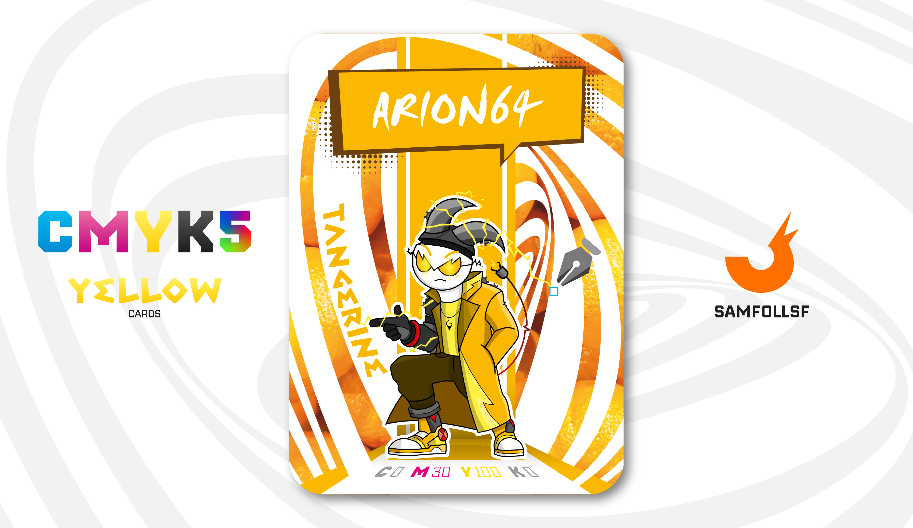

---
tags:
  - IronLine

...

# Arion64

## Descrizione

Lavora in un'isola ecologica nel blocco 64 volta a gestire i file spazzatura dei cestini degli utenti. Miracolosamente sopravvissuto a un tragico incidente, Arion ha vissuto un'esperienza unica legata a quest'ultimi. Questi funzionano un po' come buchi neri: comprimono i file per spedirli in una dimensione distorta parallela, ma solo quando vengono svuotati. Un giorno, Arion si trovò troppo vicino a un cestino durante lo svuotamento. Riuscì a salvarsi, ma perse un braccio e parte del cranio, sfuggendo per un soffio alla sua forza gravitazionale.

Tuttavia, nulla si crea e nulla si distrugge ma tutto si trasforma, e quindi da qualche parte le cose che vengono eliminate "definitivamente" stanno solo aspettando di essere sostituite.

## Colore

Come l'arancione, il Mandarino comunica spensieratezza e buon umore, ma ha una tonalità più delicata. Molto interessante per gli accessori, pensiamo alla carica che può dare a un guardaroba all'insegna della rinascita.

## Curiosità

- Ha ormai litigato un numero incalcolabile di volte con [SamFollSF](../Remix/samfollsf.md) che ormai si odiano a vicenda.
- La sua collana ha come ciondolo il simbolo di Itachi.
- La protesi che ha sulla testa ricordano vagamente delle corne dell'Hellaverse.
- Per via delle sue protesi i suoi impulsi elettrici sono più dispersivi.
- Arion64 è l'Agent di Vincenzo De Lucia.

# Versione Mazzo 1.0