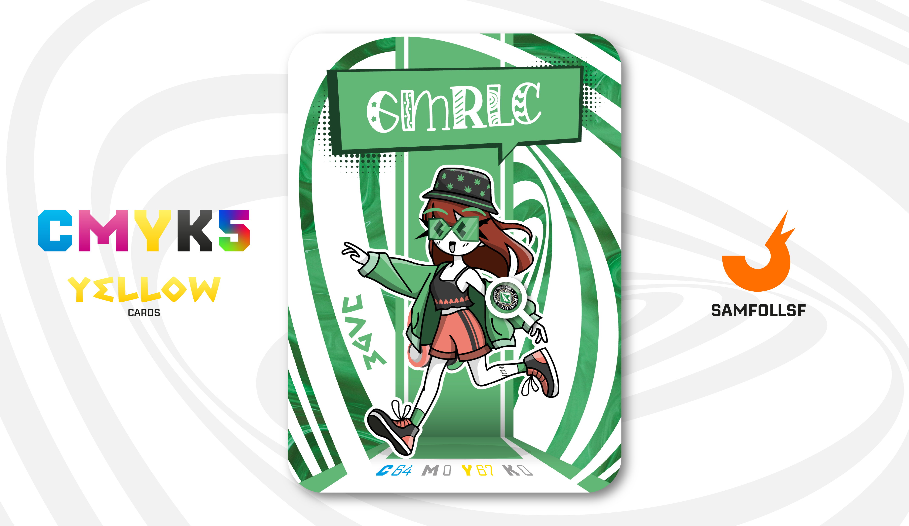

---
tags:
  - Original

...

# Gmrlc

## Descrizione

GMLRC è l'esempio perfetto di cittadino del Surface Web. In questo mondo, non esiste un vero e proprio prezzo della vita. Gli Agent o Manager, infatti, non hanno bisogno di mangiare o dormire per sopravvivere, ma dipendono dall'elettricità. Questa può essere autoprodotta attraverso l'assunzione di combustibile o tramite l'alimentazione mediante una presa di ricarica, disponibile in ogni H.U.B. di Agent o Manager.

## Colore

Un verde molto fresco, che prende il suo nome dalla gemma "Jade", una pietra che nell'antica cultura cinese veniva considerata portafortuna e capace di attirare denaro e amore.

## Curiosità

- Come per la sua controparte reale, anche lei crea delle storie dove racconta della sua vita.
- Sulla sua giacca è presente lo stemma dell'Avellino.
- Il suo cappello ha una texture di erbe particolate, e comunque no, la Marijuana non esiste nel Web, tantomeno il fumo in generale. Esistono tuttavia alcool e droghe sintetiche, anche se quest'ultime sono consumate da pochissime persone.
- Gmrlc è l'Agent di Giordana Lo Casale.

# Versione Mazzo 1.0