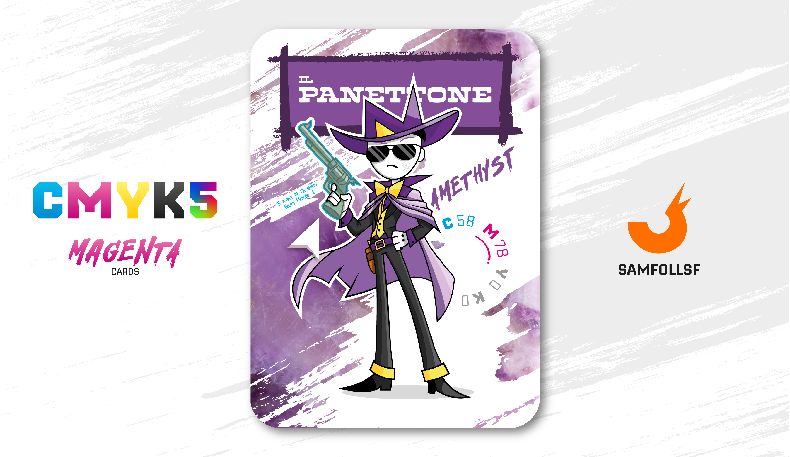

---
tags:
  - Batcancer
  - HotRide

...

# IlPanettone

## Descrizione

È l'unico Agent di cui [SamFollSF](../Remix/samfollsf.md) si fida, un leggendario compagno di avventure con cui ha condiviso innumerevoli peripezie. Per mantenersi, si dedica alla caccia di taglie nel Surface Web, che siano ricercati ufficialmente dal governo o nemici appartenenti a clan rivali. Come SamFollSF, è ricercato dalle forze dell'ordine, ma a differenza sua, è membro di un clan di sicari, l'HotRide Clan, al quale appartiene anche [Giocosty](../Nero/giocosty.md). Insieme, i due si occupano del trasporto di merci e operativi, sia per missioni aeree che terrestri.

Le ore trascorse insieme su PlayStation Network sono incalcolabili, anche se negli ultimi tempi, a causa degli impegni crescenti, il tempo per incontrarsi si è ridotto notevolmente. È curioso notare come SamFollSF abbia un amico così stretto; considerando i dettagli della sua storia, come vedremo più avanti, non era affatto scontato

## Colore

Dal colore violaceo moderato e trasparente, l'Ametista prende il nome dall'omonima pietra, un tipo di quarzo amato già dai faraoni egiziani per il suo colore, simbolo di sovranità. Si dice che un'ametista fosse anche nel sigillo della regina Cleopatra.

## Curiosità

- Prima del suo lavoro da sicario era un fotografo, passione che si porta tutt'ora con sè anche se messa da parte.
- Ha conosciuto SamFollSF negli uffici del Playstation Network mentre creava un estensione per accedere al Cloud Playstation, capendo subito che era un bastardo perfetto per essere suo amico.
- Nell'HotRide Clan il suo ruolo nello specifico è quello di pilotare elicotteri ed aereoplani d'assalto per trasportare unità operative, è molto rarp che IlPanettone si ritrovi a combattere al fronte.
- IlPanettone è l'Agent di Nunzio Di Colandrea.

# Versione Mazzo 1.0