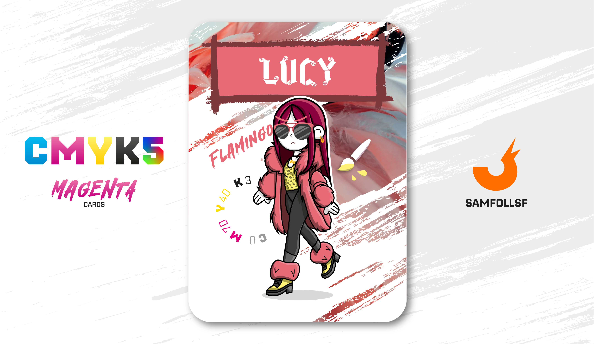

---
tags:
  - Original

...

# Lucy

## Descrizione

## Colore

Perché i fenicotteri hanno quel colore rosa così particolare e semplicemente fantastico? Lasciate stare il DNA! La verità è perché sono ghiotti del gamberetto rosa Artemia salina, da cui ottengono i carotenoidi, pigmenti che conferiscono alle loro penne il caratteristico colore.

## Curiosità

- È così famosa che ormai non paga più nemmeno i biglietti per la Metro.
- Il suo orecchino ha la forma di una punta.
- Indossa una collana con il logo EAV forgiato in [Oro](../Remix/metal.md).
- Lucy è l'Agent di Lucia Marrandino. 

# Versione Mazzo 1.0