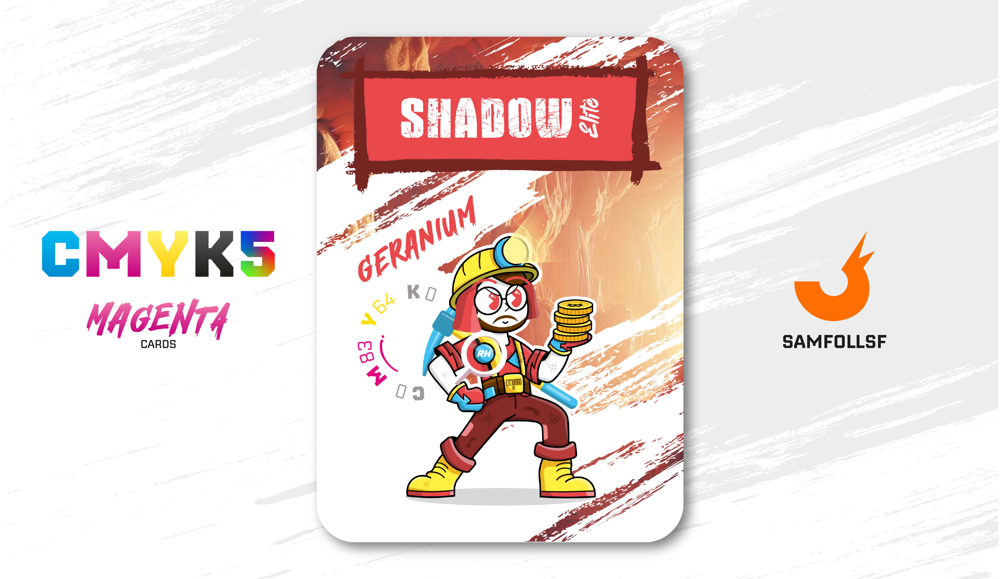

---
tags:
  - Original

...

# Shadow Èlite

## Descrizione

Il lavoro di Shadow Èlite consiste nell'estrarre dalle miniere i metalli che compongono le banconote e le monete del Web: Ferro, Alluminio, Mercurio e Titanio. Il valore della moneta aumenta progressivamente dal Ferro al Titanio, ma, a differenza dei metalli nobili, questi non conferiscono poteri particolari; sono semplicemente oggetti di valore economico. Le monete, in particolare, possono essere di vario tipo: nel Web non esiste una valuta unica, e gli Agent e i Manager possono utilizzare le crypto che ritengono più convenienti

## Colore

Rosa vivace con una punta di rosso leggermente aranciato, il Geranio è un colore caldo e allegro, che ritroviamo nella palette Spring, sia per il beauty che per abiti e accessori.

## Curiosità

- Per l'estrazione mineraria utilizza un piccone lavorato in [Diamante](../Remix/crystal.md), un cristallo molto robusto adatto a lavori così usuranti. (Carta Diamante in arrivo con il Mazzo 1.1)
- Indossa una spilla con le iniziali "RH" (Rocco Hunt, anche io stesso mi ero dimenticato per cosa stavano queste 2 lettere)
- Sulle bretelle appare la scritta "500"
- Shadow Èlite è l'Agent di Cristian Di Fraia.