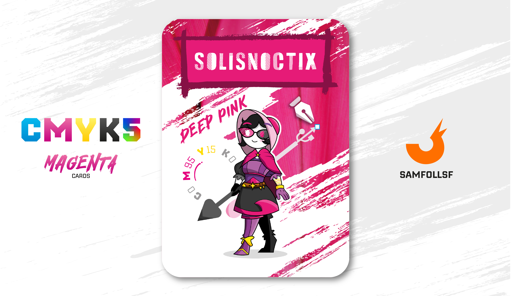

---
tags:
  - Web Crystals

...

# Solisnoctix

## Descrizione

Ella è la proprietaria della Snoctix.inc, una società detentrice dei business di [Brioch33](santin.md), [Lele](../Ciano/lele.md)
e [PickMeGiuls](../Ciano/pistilli.md). La prima lavora con Giuls nella raccolta e successiva rivendita di dati sensibili. Lele invece dirige una miniera nei siti dei [Cristalli](../Remix/crystal.md), un ordine subordinato a quello dei [Metalli](../Remix/metal.md) che permette di ottenere vari benefici.

## Colore

Il Rubellite è un colore vivace ma molto delicato, che ricorda il candore dei fiori: è perfetto nella versione monocromatica, abbinato a tessuti impalpabili come lo chiffon , ma anche a quelli più corposi come il velluto.

## Curiosità
-  n
-  Ciao 2