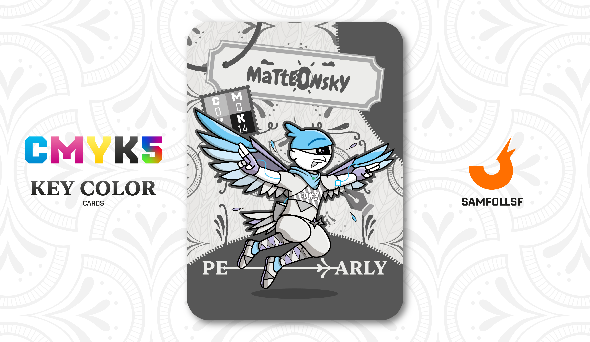

---
tags:
  - Pantera

...

# Matteowsky

## Descrizione

È un aereo? È un razzo? No è un ucc... ok, non ha mai fatto ridere, scusatemi. Matteowsky è un personaggio molto interessante, poiché è il primo Agent del mazzo a rappresentare una sorta di nomade spirituale. Ha intrapreso un percorso di crescita interiore, iniziato con la sua frequentazione del Tempio Shaolin per apprendere il kung fu.

Col tempo, più che limitarsi all’estetica di questa disciplina, ha scelto di approfondirne gli aspetti filosofici e spirituali. Questo non lo ha però allontanato dalla società: Matteowsky mantiene una cerchia di amici stretti e condivide la sua vita con la sua ragazza, [Lele](../Ciano/lele.md).

## Colore

Il colore più simile alla perla, una delle gemme ritenute più preziose sin dall'antichità. Giulio Cesare, generale romano, amante delle perle, fece approvare una legge nel I secolo a. C. che impediva ai ceti inferiori di indossarle.

## Curiosità

- È abilissimo nei combattimenti sia terrestri che aerei, grazie alle sue ali che gli permettono di planare.
- Il suo vestito ad altezza petto ha una scritta "Ciak", dal momento che Matteowsky è appassionato di Cinema.
- Indossa un casco che fa confluire i suoi occhi in uno solo, nella carta sembra essere un ciclope ma in realtà ha due occhi come tutti.
- Matteowsky è l'Agent di Matteo Uccello.

# Versione Mazzo 1.0