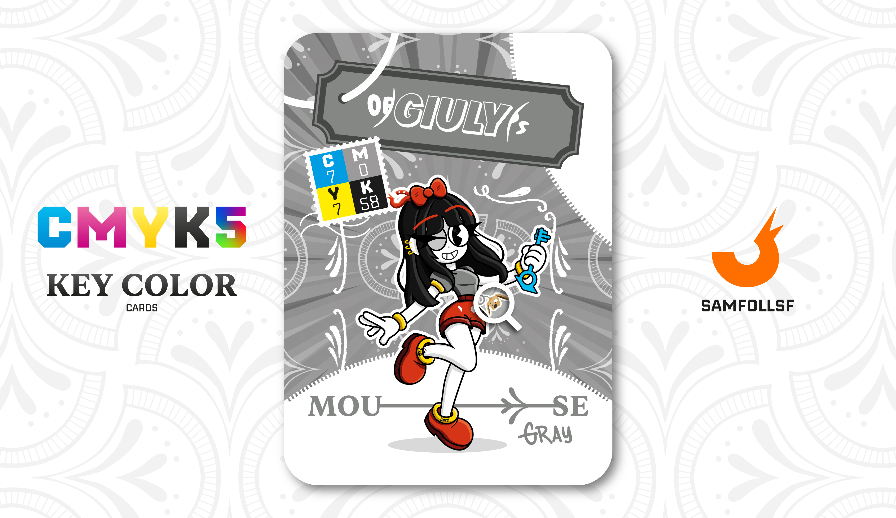

---
tags:
  - 272

...

# OpsGiuly

## Descrizione

OpsGiuly proviene dal blocco 272, dove lo stile predominante è ispirato al cartoon vintage. È in possesso di una [Chiave Quadridimensionale](../Remix/tool.md), uno Strumento dei Fondatori che consente di creare Whormole.

In maniera sconsiderata, ha deciso di girare per il Web portando questo oggetto altamente illegale ben visibile, attirando così l’attenzione delle forze dell'ordine del [Surface Web](../Remix/deep.md), dell'Operazione Red Winter e di vari criminali desiderosi di impossessarsene. Tra questi c’è anche [SamFollSF](../Remix/samfollsf.md), che, pur interessato alla Chiave, ha scelto di non forzare la situazione per evitare ulteriori guai.

Tuttavia, questo non significa che i due siano in buoni rapporti. Al contrario, si odiano profondamente, e se avessero l’opportunità di eliminarsi a vicenda in maniera controllata, non esiterebbero a farlo.

## Colore

Il Grigio Topo richiama il colore del manto dei roditori, ma è spesso usato nel gergo dei parrucchieri per denotare i capelli di base fredda, dal colore piuttosto indefinito (né castano né biondo né grigio).

## Curiosità

- Nel tempo libero gioca ad Animal Crossing, che gli permette di dissiociarsi e non pensare ai problemi della sua vita. E a dirla tutta non gioca solo nel tempo libero ma questi sono dettagli.
- Il suo nome è cambiato più volte nel corso degli anni, così come le attività che ha svolto nella sua vita. Ha iniziato nel 2015 gestendo una fan-page, poi si è dedicata al lavoro di traduttrice, fino ad arrivare a oggi, dove più che lavorare vive grazie ai soldi accumulati nel tempo.
- Ha un animale da compagnia, un piccolo orsacchiotto di nome "Biscottino".
- Perché però odia così tanto [SamFollSF](../Remix/samfollsf.md) e viceversa? Ne parlerò meglio nella sua carta.
- Sui suoi stivali ci sono due scritte che compongono la parola "Folloverse"

# Versione Mazzo 1.0