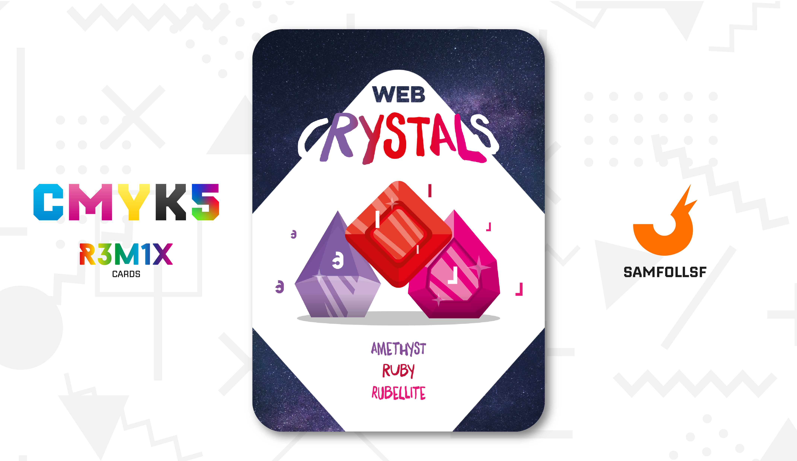
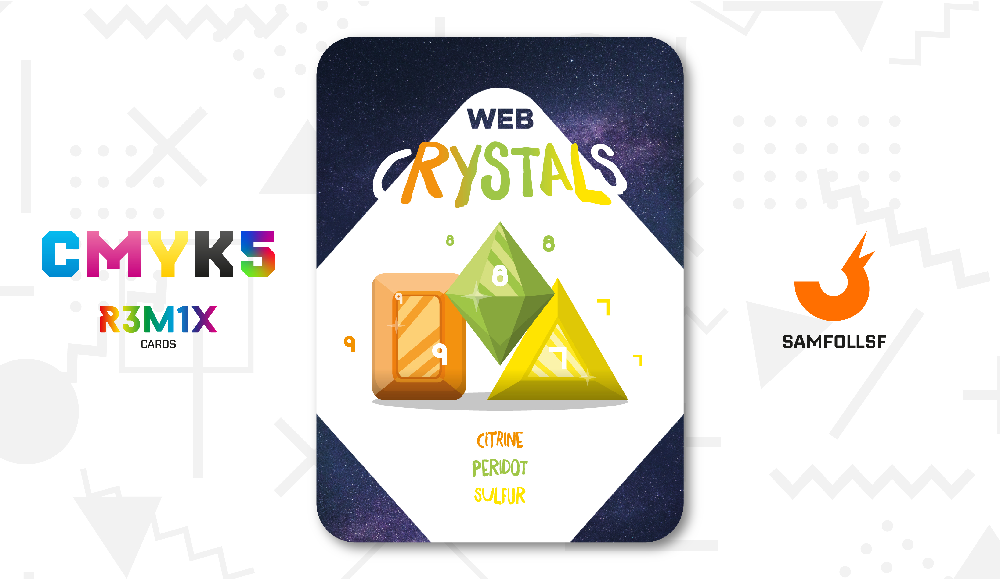

# Web Crystals

## Classificazione

descrizione

percorso immagine

descrizione

## Benefici

### Lapislazzulo, Smeraldo e Turchese

cosa fanno eblah blah.

### Ametista, Rubino e Rubellite

cosa fanno e bla.

### Citrino, Peridoto e Zolfo Cristallizato

cosa fanno

## Riferimenti

Chi possiede questi cristalli nei Mazzi CMYK?

Lapislazzulo: [The Deather](../Ciano/thedea.md)

Smeraldo:

Turchese: [KK](../Ciano/kekka.md)

Ametista: [IlPanettone](../Magenta/ilpanettone.md)

Rubino: [Chitty](../Magenta/chitty.md)

Rubellite: [Solisnoctix](../Magenta/solisnoctix.jpg)

Citrino:

Peridoto

Zolfo Cristallizato: [Frashadow](../Giallo/frashadow.md)