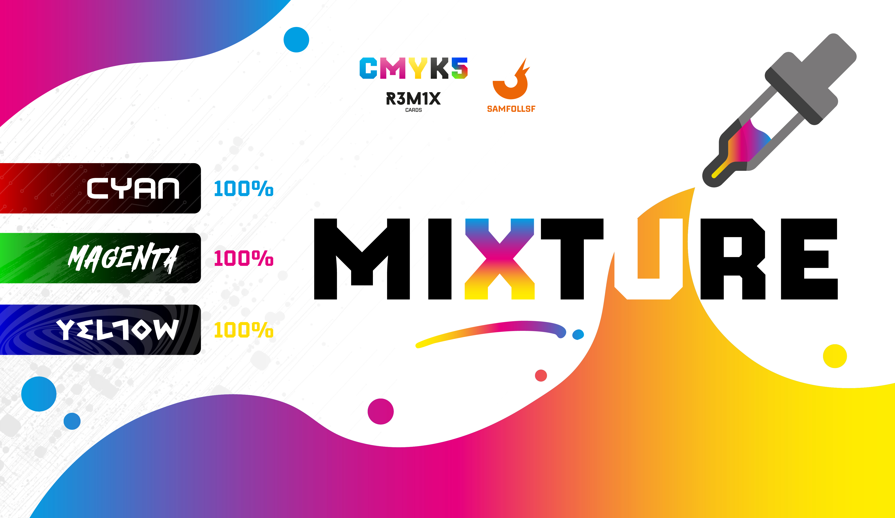
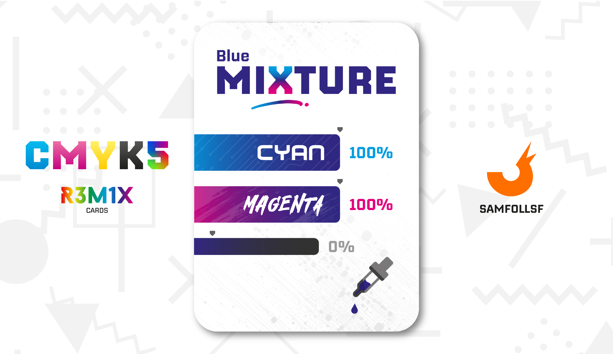
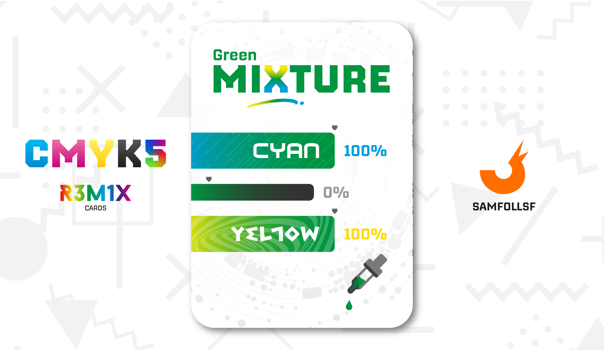

# Miscela

Rosso, Verde e Blu sono i colori che si ottengono dall'unione di due colori primari della sintesi sottrattiva, che qui prendono il nome di "Miscele". È curioso vedere come unendo due colori della sintesi sottrattiva ne otteniamo uno di quella additiva, anche se con meno brillantezza.

## Blu

La miscela Blu si ottiene unendo il 100% di Ciano con il 100% di Magenta.

Descrizione Colore: Con molta probabilitàa i primi a distinguerlo furono gli egiziani, e da quel momento la storia del blu ha conosciuto toni e sfumature, nobiltà e status, pace e guerra, mistica compresa. Oggi è il colore preferito di metà della popolazione mondiale.

## Rosso

La miscela Rossa si ottiene unendo il 100% di Magenta con il 100% di Giallo.

Descrizione Colore: Rosso parla di antiche divinità e creature mitologiche, di matrone e regine. Di vino, sangue e forza, di guance innamorate. Racconta le passioni dell'umanità, le colora, dà loro ambizione. A Roma era il colore degli imperatori. Ancora oggi, il rosso sa accelerare il battito cardiaco e la pressione sanguigna.

## Verde

la miscela Verde si ottiene unendo il 100% di Giallo con il 100% di Ciano.

# Versione Mazzo 1.0