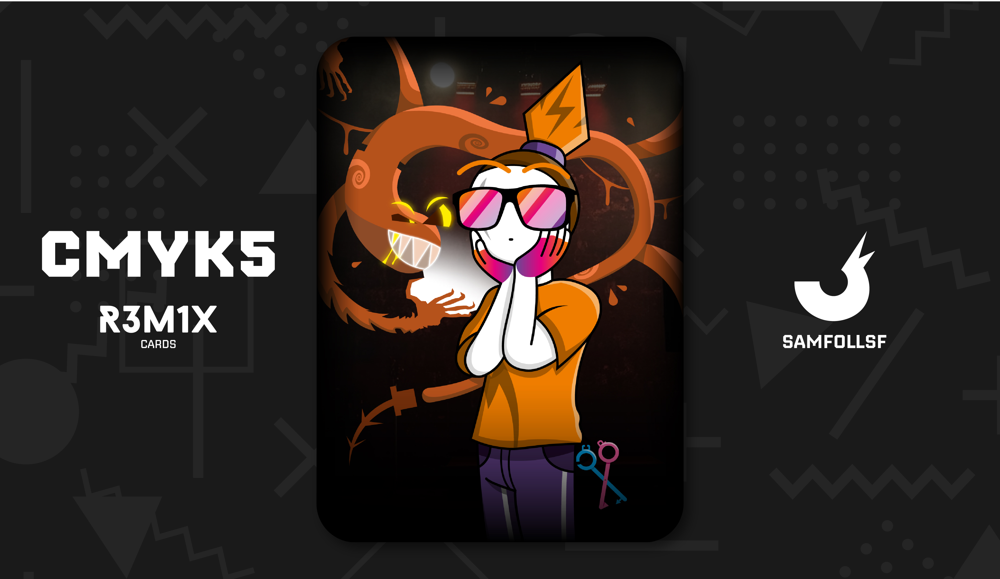

---
tags:
  - 87

...

# SamFollSF

## Descrizione

Arriviamo al mio Agent, SamFollSF. Egli è un personaggio cruciale nella trama del Mazzo, e ve ne sarete accorti se avete letto le descrizioni delle altre carte. Ribadisco anche qui come Agent e Persona reale sono due soggetti completamente diversi che da un punto di vista caratteriale non hanno nulla a che fare l'una con l'altra, e Sam non fa eccezioni.

Come ho già detto nella carta di BlaseJewel51, la vita da fuggitivo e latitante di Sam inzierà quando i due evaderanno di Prigione insieme, anche se nella sua carta parlerò anche del declino fra i due. Oggi Sam non sa nemmeno dove sia il fratello, e a dirla tutta non gli importa assolutamente nulla, e anzi spera sia  morto in quell'inferno.

È in possesso di una Chiave Copypasta, rubata a un contrabbandere di programmi Adobe nel 2021, e quando quest'ultimo si è rifiutato di dargliela Sam non ha esitato un istante a ucciderlo. Quest'ultimo è estremamente spietato, non si fa problemi ad uccidere, per arrivare ai suoi obiettivi è disposto a fare di tutto. Ciò che però non sapeva è che quel contrabbandiere era un uomo di Sa742sa, e una volta che il titolare della prigione del blocco 51 è stato informato di questa notizia le sue ricerche per catturare SamFollSF sono lentamente riniziate.

Una personalità così mavlagia e spietata non poteva che avere una folta collezione di nemici e persone che vogliono ucciderlo, quindi ecco a voi solo una parte dei casini in cui SamFollSF si è cacciato:

 - È un caso ancora aperto nel padiglione ricercati e dispersi della Web Intelligence a carica di Angy.

 - Evase dalla prigione più grande del blocco 51 e avrebbe dovuto scontare 2 anni, ma per via dell'evasione se dovesse essere arrestato di nuovo la pena salirebbe a 6 anni (+1 non scontato). Sulle sue tracce c'è Sawako.

 - Dopo un pesantemente litigato con Red Ghost per via di un'attività che SamFollSF ha brutalemnte fatto fallire dopo qualche giorno i due ora non si parlano da circa due anni.

 - Ha tentato di assassinare OpsGiuly nell'autunno del 2023 per ottenere la sua Chiave Quadridimensionale, ma per colpa della sua spavalderia aveva sottovalutato l'avversario, e ora si trova a dover combattere anche contro PLACE HOLDER.
 
 - È in debito di un diamante dalla Snoctix.Inc che non sa bene poter ridare indietro, ma questo è un elemento di trama che verrà esplorato in futuro.

blah blah.

immagine

## Curiosità

# Versione Mazzo 1.0