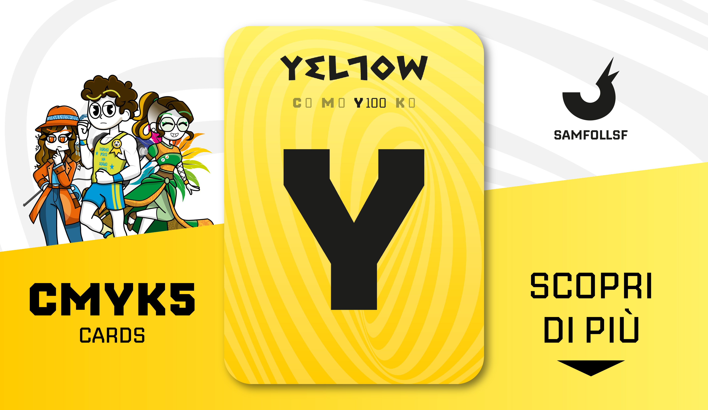

# Giallo

Carta al 100% Gialla, indispensabile per la sintesi sottrattiva. Il tema di questo mazzo è il caos e l'illusione.

Usa la lista di Sinistra per scoprire tutte le carte dal colore prevalentemente Gialle!